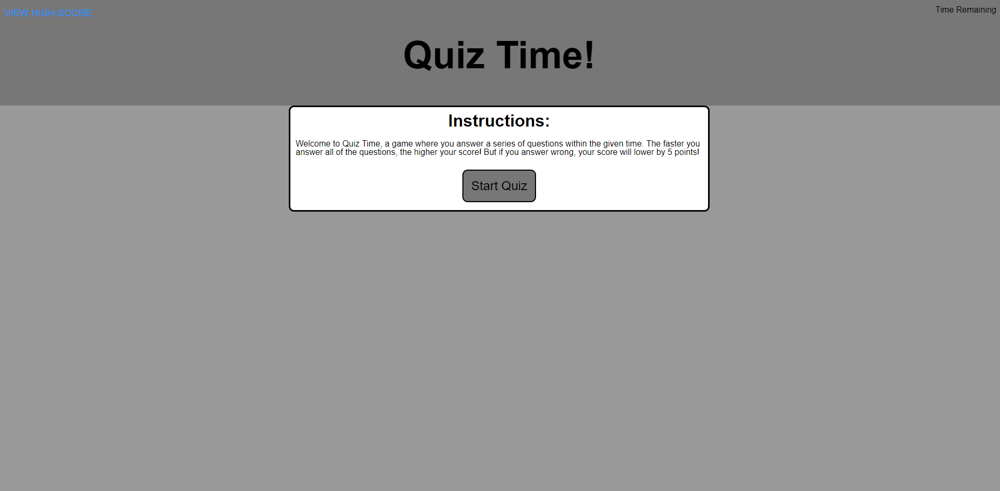
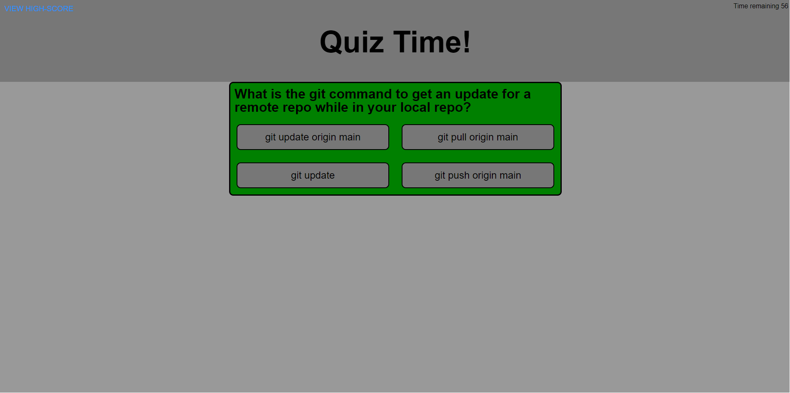
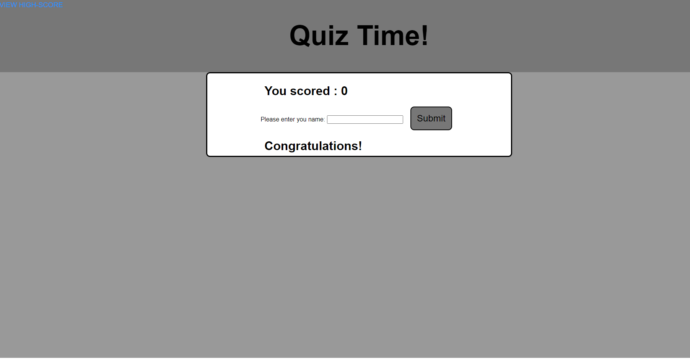

# <QUIZ TIME - README>

## Description

This is an application to play a small trivia game!
It asks a series of questions and depending on how you answer, you can earn a better score.

During this project I learned a HUGE amount of new JavaScript. Thought I've only just dipped a toe in the vast ocean of knowledge that is JavaScript, it's showing me a large functionality of the language.

## Installation

n/a

## Usage

## Credits

n/a

## License

See license in repo.
